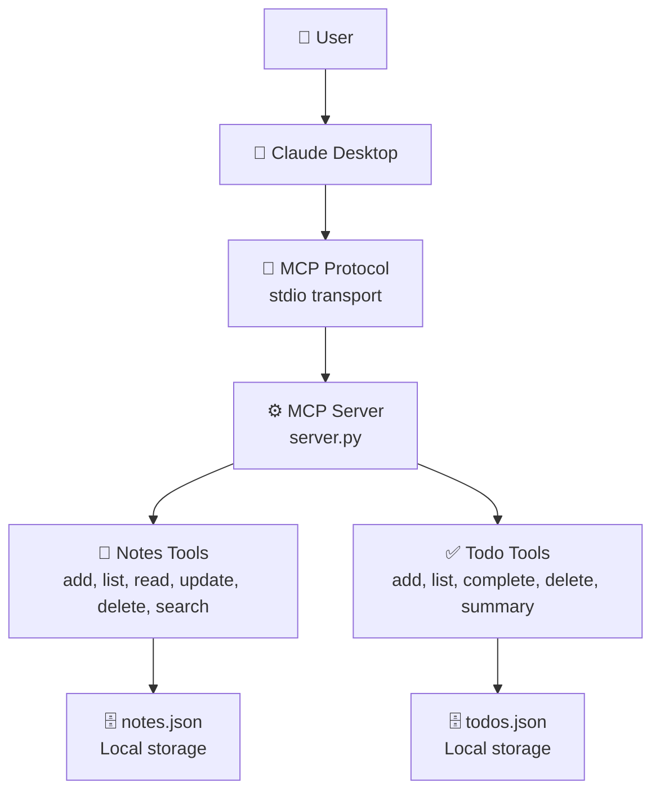
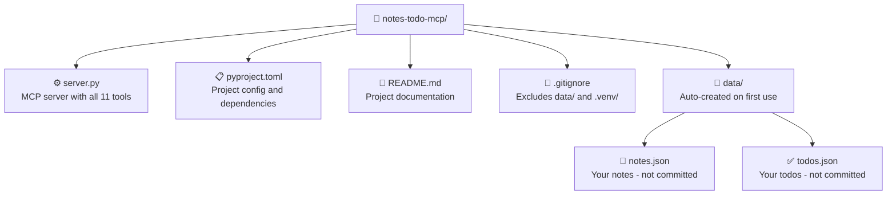

# 📝 Notes & Todo MCP Server

A custom Model Context Protocol (MCP) server that connects Claude Desktop
to a local notes and todo management system — giving Claude the ability to
create, read, update, delete, and search your notes and todos directly from
conversation.


---

## 🌟 What This Project Does

Instead of switching between apps to manage notes and tasks, you can talk
to Claude Desktop naturally:

- *"Add a note about today's standup meeting"*
- *"Show me all my high priority todos"*
- *"Search my notes for anything about LangChain"*
- *"Mark my AWS certification task as complete"*
- *"Give me a summary of all my notes and todos"*

Claude uses the MCP tools automatically — no commands needed.

---

## 🏗️ Architecture



---

## 📁 Project Structure



---

## 🛠️ 11 Available Tools

### 📝 Notes Tools

| Tool | Description |
|---|---|
| `add_note` | Add a new note with title, content, and tags |
| `list_notes` | List all notes, optionally filtered by tag |
| `read_note` | Read the full content of a note by ID |
| `update_note` | Update the title or content of a note |
| `delete_note` | Delete a note by ID |
| `search_notes` | Search notes by keyword in title or content |

### ✅ Todo Tools

| Tool | Description |
|---|---|
| `add_todo` | Add a todo with priority (low/medium/high) and due date |
| `list_todos` | List todos filtered by status or priority |
| `complete_todo` | Mark a todo as completed |
| `delete_todo` | Delete a todo by ID |
| `get_summary` | Get counts of all notes and todos by priority |

---

## ✨ Features

- 📝 **Full Notes CRUD** — create, read, update, delete, search
- ✅ **Todo Management** — add tasks with priority levels and due dates
- 🏷️ **Tag Support** — organise notes with comma-separated tags
- 🔴🟡🟢 **Priority System** — high, medium, low priority todos
- 🔍 **Keyword Search** — search across note titles and content
- 📊 **Summary View** — overview of all notes and pending tasks
- 💾 **Local Storage** — data stored as JSON files on your machine
- 🔒 **Private** — all data stays on your computer, never leaves

---

## 🚀 Getting Started

### Prerequisites
- Python 3.12+
- Claude Desktop app installed
- `uv` package manager

### 1. Clone the repository
```bash
git clone https://github.com/keerthihp96/notes-todo-mcp.git
cd notes-todo-mcp
```

### 2. Install dependencies
```bash
uv add mcp
```

### 3. Test the server runs
```bash
uv run python server.py
```
No output and no error means it's working — the server is waiting
for connections. Press **Ctrl+C** to stop.

### 4. Find your uv path
```bash
which uv
# e.g. /Users/yourname/.local/bin/uv
```

### 5. Configure Claude Desktop

Open your Claude Desktop config file:
```bash
open -e ~/Library/Application\ Support/Claude/claude_desktop_config.json
```

Add the `mcpServers` section — replace paths with your actual paths:
```json
{
  "mcpServers": {
    "notes-todo": {
      "command": "/Users/yourname/.local/bin/uv",
      "args": [
        "run",
        "--project",
        "/full/path/to/notes-todo-mcp",
        "python",
        "/full/path/to/notes-todo-mcp/server.py"
      ]
    }
  }
}
```

### 6. Restart Claude Desktop
```bash
pkill -f "Claude"
```
Then reopen Claude Desktop from your Applications folder.

### 7. Test it
Type in Claude Desktop chat:
```
Add a note titled "My first note" with content "MCP server is working!"
```

Claude will automatically use the `add_note` tool. ✅

---

## 💬 Example Conversations

**Adding a note:**
```
You:    Add a note titled "AWS Study Plan" with content 
        "Complete EC2, S3, Lambda modules this week" 
        with tags "study, aws"

Claude: ✅ Note added successfully!
        ID     : note_1_143022
        Title  : AWS Study Plan
        Tags   : study, aws
```

**Adding a todo:**
```
You:    Add a high priority todo "Apply for AI Engineer roles" 
        due 2026-05-31

Claude: ✅ Todo added!
        ID      : todo_1_143045
        Task    : Apply for AI Engineer roles
        Priority: high
        Due     : 2026-05-31
```

**Getting a summary:**
```
You:    Give me a summary of all my notes and todos

Claude: 📊 Summary
        ════════════════════════════
        📝 NOTES    : 5 total
        📋 TODOS    : 8 total
        ⏳ Pending  : 6
        ✅ Completed: 2
        🔴 High     : 3
        🟡 Medium   : 2
        🟢 Low      : 1
```

---

## 🔍 Troubleshooting

**Server disconnects immediately:**
```bash
# Check mcp version
uv pip show mcp

# Upgrade if needed
uv pip install "mcp>=1.0.0" --upgrade
```

**Hammer icon not showing in Claude Desktop:**
- Make sure you used the full path to `uv` in the config
- Fully quit Claude with `pkill -f "Claude"` and reopen
- Check logs at `~/Library/Logs/Claude/mcp-server-notes-todo.log`

**Permission errors:**
```bash
chmod +x server.py
```

---

## 📂 Data Storage

Your notes and todos are stored locally at:
```
notes-todo-mcp/
└── data/
    ├── notes.json    ← your notes
    └── todos.json    ← your todos
```

This folder is excluded from git — your data never leaves your machine.

---

## 🔒 Privacy

- All data is stored locally as JSON files
- Nothing is sent to any external server
- Claude Desktop communicates with the MCP server via local stdio
- Your notes and todos are never uploaded anywhere

---

## 📄 License

MIT License — feel free to use this as a template for your own MCP servers.

---

## 👩‍💻 Author

**Keerthi Vinukonda**
- LinkedIn: linkedin.com/in/keerthi-v-4022a8263/
- GitHub: github.com/keerthihp96

---

## 🔗 Related Projects

- [Text2SQL Agentic AI](https://github.com/keerthihp96/text2sql-react-agent) — ReAct agent for natural language database queries
- [Chat with PDF](https://github.com/keerthihp96/pdf_chatter) — RAG application for chatting with PDF documents
